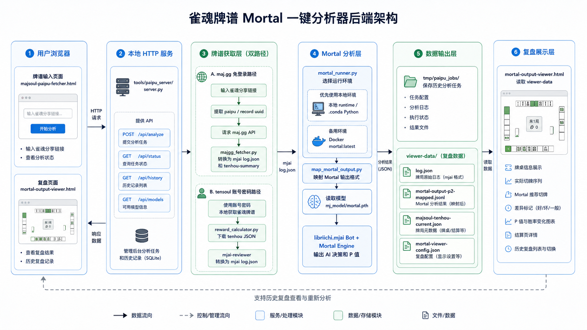
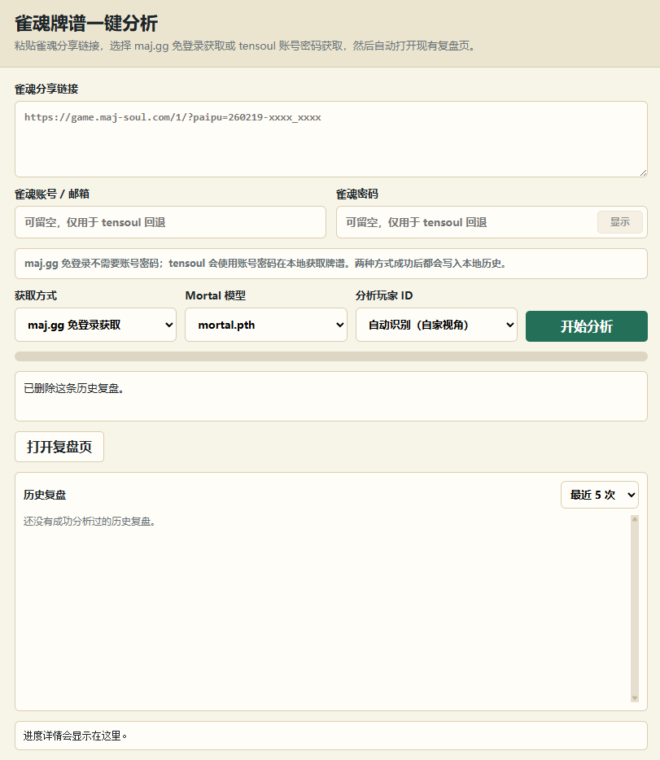
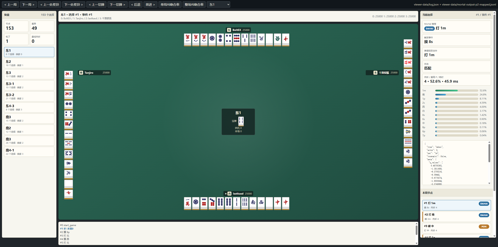

# 雀魂牌谱 Mortal 一键分析器

这是一个基于 [Mortal](https://github.com/Equim-chan/Mortal) 改造的本地雀魂牌谱分析工具。它的目标是把“复制雀魂分享链接 -> 获取牌谱 -> 运行 Mortal -> 打开复盘页面”这条流程做成一个简单的一键入口。

本项目保留了 Mortal 的核心 AI 推理能力，并增加了一个本地网页：

- 粘贴雀魂牌谱分享链接。
- 选择获取方式：`maj.gg 免登录获取` 或 `tensoul 账号密码获取`。
- 选择分析玩家和 Mortal 模型。
- 自动生成复盘数据并打开本地复盘页面。
- 在复盘页里查看实际切牌、Mortal 推荐、P 值、差异标记和每局结算。

## 界面预览

<p align="center">
  
</p>

<p align="center">
  <strong>后端架构与数据流</strong>
</p>

<p align="center">
  
</p>

<p align="center">
  <strong>牌谱输入与分析入口</strong>
</p>

<p align="center">
  
</p>

<p align="center">
  <strong>Mortal 复盘页面</strong>
</p>

## 快速开始

Windows 下最简单的启动方式：

```bat
启动雀魂分析器.cmd
```

浏览器会打开：

```text
http://127.0.0.1:8765/paipu-analyzer.html
```

如果你想手动启动服务：

```powershell
powershell -ExecutionPolicy Bypass -File .\start-paipu-server.ps1
```

## 模型文件

Mortal 模型统一放在：

```text
mj_model/
```

仓库中保留了一个默认模型：

```text
mj_model/mortal.pth
```

如果要切换模型，把新的 Mortal 兼容 `.pth` 放进 `mj_model`，然后在“一键分析”页面的 `Mortal 模型` 下拉框里选择即可。

模型文件需要兼容 Mortal 的权重格式，至少包含：

```text
state['config']
state['mortal']
state['current_dqn']
```

## 牌谱获取方式

### maj.gg 免登录获取

默认方式。它会使用 [maj.gg](https://maj.gg/) 的 API 读取公开雀魂牌谱数据，不需要输入账号密码。

这条路径适合大多数分享链接，也是推荐的主路径。

### tensoul 账号密码获取

备用方式。它通过 [tensoul](https://pypi.org/project/tensoul/) 在本地获取雀魂牌谱，需要输入雀魂账号和密码。

账号密码只在本地服务运行时作为参数传入，不会写入历史记录或项目文件。错误信息里也会做脱敏处理。

## 运行数据

分析过程中会生成两类本地数据：

```text
viewer-data/
tmp/paipu_jobs/
```

`viewer-data` 保存当前复盘页正在读取的数据。`tmp/paipu_jobs` 保存历史分析任务和中间文件。这些都是本地运行产物，不建议提交到 GitHub。

## 便携运行环境

如果不想依赖 Docker Desktop，可以用脚本创建本地 Python runtime：

```powershell
powershell -ExecutionPolicy Bypass -File .\scripts\setup-runtime.ps1
```

打包便携版：

```powershell
powershell -ExecutionPolicy Bypass -File .\scripts\package-portable.ps1
```

便携包会包含 `runtime`、页面、脚本和 `mj_model` 下的模型文件。

### 环境检查

双击 `检查环境.cmd` 可以自动检测 Python 依赖是否完整（torch、mahjong、tensoul、numpy 等）。如果有缺失会自动安装，全部通过则显示"环境检查通过"。首次使用或遇到启动报错时建议先运行一次。

## 项目结构

```text
tools/paipu_server/       本地分析服务和牌谱获取逻辑
tools/map_mortal_output.py Mortal 输出映射脚本
mortal-output-viewer.html  复盘页面
majsoul-paipu-fetcher.html 牌谱输入页面
mj_model/                 Mortal 模型目录
viewer-data/              当前复盘数据目录
scripts/                  runtime 安装和便携打包脚本
```

## 开源项目与致谢

这个项目建立在多个开源项目和公开服务之上，感谢这些作者和维护者：

- [Equim-chan/Mortal](https://github.com/Equim-chan/Mortal)：本项目的基础，提供日麻 AI、`libriichi`、mjai Bot 和核心推理代码。
- [Mortal 文档站](https://mortal.ekyu.moe/)：Mortal 的使用和模型说明。
- [MahjongRepository/mahjong](https://github.com/MahjongRepository/mahjong)：用于日麻和牌、役种、番符相关计算。
- [maj.gg](https://maj.gg/)：提供公开雀魂牌谱的免登录解析能力，本项目的默认牌谱获取路径会调用它的 API。
- [tensoul](https://pypi.org/project/tensoul/)：作为账号密码方式获取雀魂牌谱的备用路径。

本仓库是在 Mortal 的基础上做的本地工具化改造。请遵守上游项目和依赖库的许可证要求。

## 许可证

上游 Mortal 使用 AGPL-3.0-or-later。由于本项目基于 Mortal 改造，代码也应按 AGPL-3.0-or-later 使用和分发。

如果你替换或再分发其他模型权重，请自行确认对应模型权重的许可。
